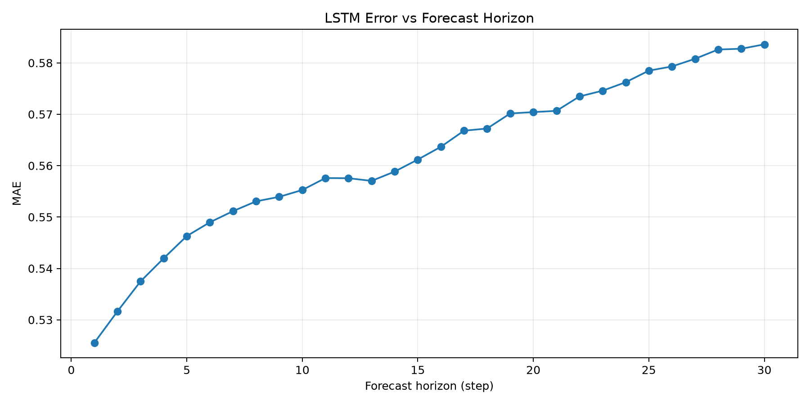
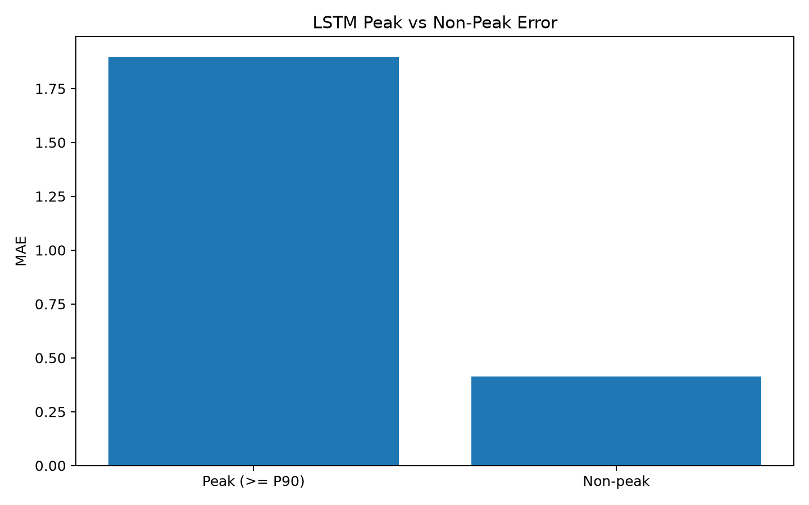
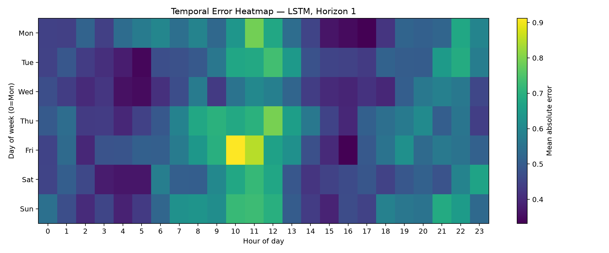
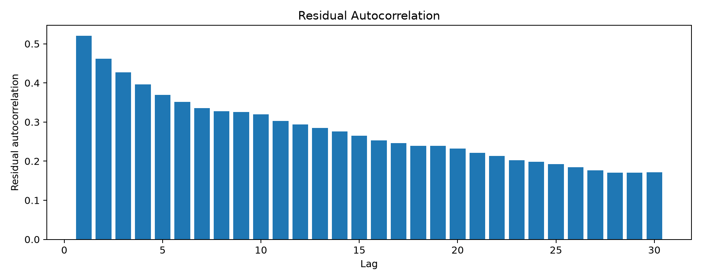
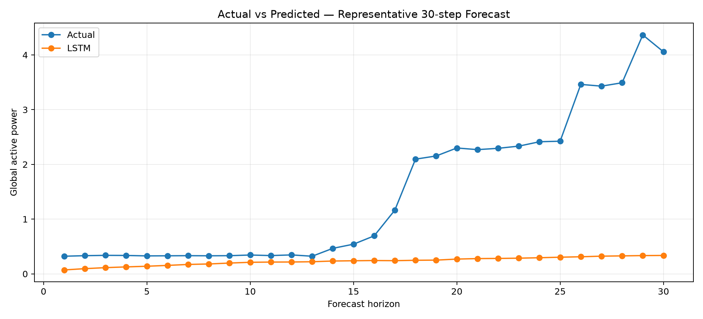
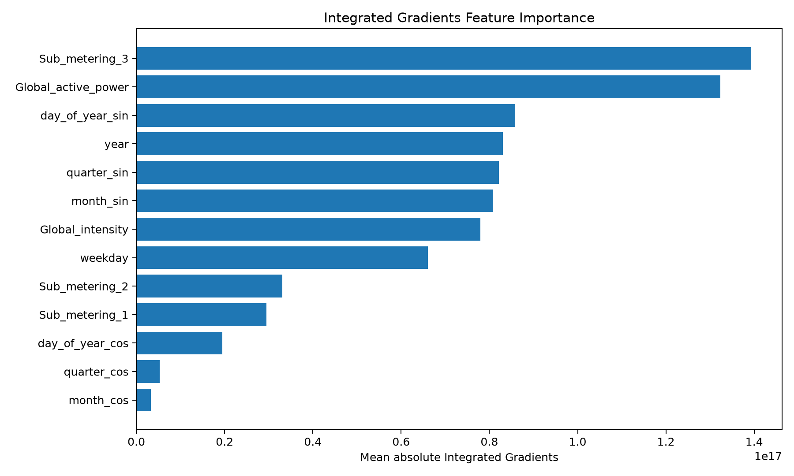
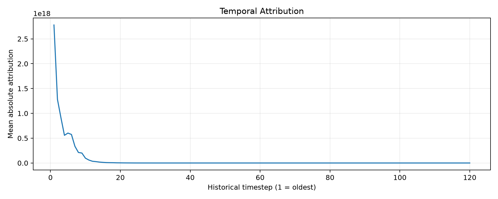

# Multivariate Household Energy Forecasting, Explainability & LLM Evaluation

> **Project focus:** 30-step multivariate household electricity forecasting using LSTM, systematic evaluation, Captum Integrated Gradients, robustness analysis, and grounded LLM-generated explanations.

# 1. Overview

This project studies short-horizon household electricity consumption forecasting using historical electrical measurements and engineered temporal features.

The goal is not only to generate predictions, but to build an evaluation pipeline that answers:

1. Does the model actually work?
2. Is it better than simpler forecasting approaches?
3. When does it fail?
4. Are its errors structured?
5. What information does it rely on?
6. Are the explanations faithful to the model?
7. Can an LLM explain the model without introducing unsupported claims?

The main forecasting model is an **LSTM** that predicts the future `Global_active_power` signal over a **30-step horizon**.

---

# 2. Problem Formulation

The task is formulated as a multivariate sequence forecasting problem:

```text
Historical multivariate window
            |
            v
     Preprocessing
            |
            v
       LSTM model
            |
            v
    30-step forecast
            |
            v
 Global_active_power
```

The project separates:

- data preprocessing,
- model training,
- model evaluation,
- explainability,
- LLM-based interpretation,
- robustness analysis,

---

# 3. Data and Features

The dataset contains household electrical measurements together with calendar-derived temporal features.

### Electrical features

| Feature | Role |
|---|---|
| `Global_active_power` | Forecast target and historical input |
| `Global_reactive_power` | Reactive power |
| `Voltage` | Voltage measurement |
| `Global_intensity` | Global intensity |
| `Sub_metering_1` | Sub-metering measurement |
| `Sub_metering_2` | Sub-metering measurement |
| `Sub_metering_3` | Sub-metering measurement |

### Temporal features

The model also uses engineered temporal representations including:

- `year`
- `weekday`
- `quarter_sin`
- `quarter_cos`
- `month_sin`
- `month_cos`
- `day_of_year_sin`
- `day_of_year_cos`

These allow the model to represent recurring calendar and seasonal structure.

### 3.1 Raw Dataset

The raw dataset used in this project is the **Individual Household Electric Power Consumption** dataset from the UCI Machine Learning Repository.

**Source:** [UCI Machine Learning Repository — Individual Household Electric Power Consumption](https://archive.ics.uci.edu/dataset/235/individual+household+electric+power+consumption)

The original dataset serves as the source for the preprocessing and feature-engineering pipeline. The raw data is processed to construct the multivariate time-series inputs and target sequences used by the forecasting models.

> **Dataset citation:** Hebrail, G. & Berard, A. (2006). *Individual Household Electric Power Consumption*. UCI Machine Learning Repository. https://doi.org/10.24432/C58K54

---

# 4. Evaluation Strategy

Rather than relying on a single MAE value, the project evaluates the forecasting system from several complementary perspectives.

### Core evaluation suite

| Category | Evaluation |
|---|---|
| Data validity | Leakage / split validation |
| Baseline | Persistence |
| Baseline | Seasonal Naive |
| Classical ML | XGBoost |
| Deep learning | LSTM |
| Accuracy | MAE |
| Accuracy | RMSE |
| Relative error | sMAPE / MASE where applicable |
| Forecast behaviour | Horizon-wise error |
| Regime analysis | Peak vs non-peak error |
| Temporal analysis | Day/hour error |
| Diagnostics | Residual analysis |
| Sensitivity | Feature ablation |
| Sensitivity | Lookback ablation |
| Explainability | Integrated Gradients |
| Explainability | Temporal attribution |
| LLM evaluation | Grounding |
| LLM evaluation | Hallucination |
| LLM evaluation | Causal-overclaim |

---

# 5. Baseline Comparison

The LSTM is evaluated against progressively stronger reference models:

```text
Persistence
      |
      v
Seasonal Naive
      |
      v
XGBoost
      |
      v
LSTM
```

This establishes whether the neural model learns useful temporal structure beyond simple forecasting rules.

Relevant outputs:

| Model          |      MAE |     RMSE |   sMAPE_% |    MASE |
|:---------------|---------:|---------:|----------:|--------:|
| Persistence    | 0.350385 | 0.670852 |   33.7408 | 4.03063 |
| Seasonal Naive | 0.689125 | 1.05273  |   62.5639 | 7.9273  |
| LSTM           | 0.561946 | 0.854072 |   59.8693 | 6.46431 |
| XGBoost        | 0.791852 | 1.12713  |  110.782  | 9.10901 |

---

# 6. Forecast Horizon Analysis

A single aggregate metric can hide how performance changes as the model forecasts further into the future.

The project therefore calculates error separately for every forecast step.

The current evaluation shows a gradual increase in MAE across the 30-step horizon:

- approximately **0.525 at the first step**
- approximately **0.584 by step 30**

Output:

 <a href="evaluation_outputs/Figure_3_error_vs_horizon.png"></a>

This demonstrates degradation of predictive accuracy with increasing forecast horizon.

---

# 7. Peak vs Non-Peak Analysis

Energy forecasting performance can differ substantially between ordinary and high-demand periods.

The evaluation separates observations into:

- **Peak:** target >= P90
- **Non-peak:** target below P90

The current evaluation snapshot shows approximately:

```text
Peak MAE      ≈ 1.9
Non-peak MAE  ≈ 0.4
```

The model therefore has a much larger error during high-consumption events.

Outputs:

<a href="evaluation_outputs/Figure_4_peak_vs_nonpeak.png"></a>

#### Peak vs non-peak evaluation


| Model       | Regime        |      MAE |     RMSE |   sMAPE_% |     MASE |
|:------------|:--------------|---------:|---------:|----------:|---------:|
| LSTM        | Peak (>= P90) | 1.89631  | 2.1353   |   93.7955 | 21.8141  |
| LSTM        | Non-peak      | 0.413541 | 0.550879 |   56.0961 |  4.75714 |
| Persistence | Peak (>= P90) | 1.05645  | 1.44924  |   43.8137 | 12.1528  |
| Persistence | Non-peak      | 0.271858 | 0.516241 |   32.6205 |  3.1273  |

This is one of the most important failure-mode analyses in the project.

---

# 8. Temporal Error Analysis

The project evaluates error as a function of:

- day of week
- hour of day

The temporal heatmap shows that error is not uniformly distributed across the week.

The current snapshot contains a particularly high-error region around the late-morning period, with the strongest visible cell around Friday late morning.

Output:

<a href="evaluation_outputs/Figure_5_temporal_error_heatmap.png"></a>

This helps identify temporal regimes where the model performs poorly.

---

# 9. Residual Analysis

Residual analysis investigates whether predictable structure remains in the model's errors.

The residual autocorrelation plot shows strong positive autocorrelation:

- lag 1 is approximately **0.52**
- positive autocorrelation persists across many subsequent lags

Output:
<a href="evaluation_outputs/Figure_residual_autocorrelation.png"></a>
This indicates that the model has not completely removed temporal structure from the residuals.

In practical terms:

> The LSTM learns useful structure, but predictable information remains in the forecasting error.

---

# 10. Representative Forecast

The project visualizes a representative 30-step prediction against the actual target trajectory.

Output:
<a href="evaluation_outputs/Figure_2_actual_vs_predicted.png"></a>

The current evaluation snapshot exposes a significant issue: the predicted trajectory is strongly compressed relative to the actual signal.

The actual sequence rises above 4 in the displayed example, while the model prediction remains much lower.

This should currently be treated as an **evaluation finding**, not hidden from the project.

Possible causes to investigate include:

- target scaling/inverse transformation,
- output-target alignment,
- preprocessing mismatch,
- training convergence,
- model capacity,
- distribution mismatch.

Therefore, the current README does **not** claim that the final forecasting model is production-ready.

---

# 11. Feature Ablation

Feature ablation measures the effect of removing or neutralizing individual inputs.

Conceptually:

```text
Full feature set
      |
      +--> remove feature A --> evaluate
      +--> remove feature B --> evaluate
      +--> remove feature C --> evaluate
      +--> ...
```

Output:

[View full file →](evaluation_outputs/feature_ablation.csv)

| Feature             |   Base_MAE |   Ablated_MAE |   MAE_change |   Relative_change_% |
|:--------------------|-----------:|--------------:|-------------:|--------------------:|
| Global_active_power |   0.570728 |      0.630692 |   0.0599642  |           10.5066   |
| Global_intensity    |   0.570728 |      0.617784 |   0.0470558  |            8.24488  |
| Sub_metering_3      |   0.570728 |      0.578319 |   0.00759071 |            1.33001  |
| Sub_metering_1      |   0.570728 |      0.568401 |  -0.00232673 |           -0.407677 |
| weekday             |   0.570728 |      0.567725 |  -0.00300282 |           -0.526139 |

Ablation complements attribution because a feature can have high attribution without necessarily producing a large performance degradation when removed.

---

# 12. Lookback Sensitivity

The model depends on the amount of historical context supplied to the LSTM.

The project therefore evaluates different lookback configurations.

The complete lookback-sensitivity experiment is linked from the preview below.

#### Lookback sensitivity

[View full file →](evaluation_outputs/lookback_sensitivity.csv)

|   Lookback |      MAE |     RMSE |   sMAPE_% |    MASE | Interpretation       |
|-----------:|---------:|---------:|----------:|--------:|:---------------------|
|         60 | 0.572454 | 0.872414 |   60.7255 | 6.58518 | same trained weights |
|        120 | 0.569603 | 0.855295 |   60.6998 | 6.55238 | same trained weights |
|        240 | 0.561673 | 0.846871 |   59.8297 | 6.46117 | same trained weights |

---

# 13. Integrated Gradients Explainability

The project uses **Captum Integrated Gradients (IG)** to investigate the inputs that contribute most strongly to model predictions.

IG is interpreted as an **attribution method**, not as causal inference.


---

## Global Feature Attribution

The current attribution result shows high mean absolute attribution for features including:

1. `Sub_metering_3`
2. `Global_active_power`
3. `day_of_year_sin`
4. `year`
5. `quarter_sin`
6. `month_sin`
7. `Global_intensity`
8. `weekday`

Outputs:

<a href="evaluation_outputs/Figure_8_IG_feature_importance.png"></a>

The five highest-attribution features are previewed below.

#### Integrated Gradients feature importance

[View full file →](evaluation_outputs/Table_IG_feature_importance.csv)

| Feature             |   Mean_abs_attribution |
|:--------------------|-----------------------:|
| Sub_metering_3      |            1.39358e+17 |
| Global_active_power |            1.32342e+17 |
| day_of_year_sin     |            8.58194e+16 |
| year                |            8.30874e+16 |
| quarter_sin         |            8.21436e+16 |

The attribution magnitudes should be interpreted relatively, particularly because the model operates on transformed/scaled inputs.

They should not be interpreted as physical energy units.

---

# 14. Temporal Attribution

Feature attribution does not tell us when historical information was important.

The project therefore aggregates Integrated Gradients over historical timesteps.

Output:
<a href="evaluation_outputs/Figure_9_temporal_attribution.png"></a>

The first five historical timesteps are previewed below; the link opens the complete attribution table.

#### Temporal attribution

[View full file →](evaluation_outputs/Table_temporal_attribution.csv)

|   Historical_timestep |   Mean_abs_attribution |
|----------------------:|-----------------------:|
|                     1 |            2.77981e+18 |
|                     2 |            1.28165e+18 |
|                     3 |            9.10135e+17 |
|                     4 |            5.57507e+17 |
|                     5 |            6.02751e+17 |

The current result shows a strong concentration of attribution toward the most recent historical observations.

This indicates that recent observations dominate the model's current predictions, while older observations contribute substantially less.

---

# 15. Attribution Is Not Causality

A central principle of the project is:

```text
Attribution != Causality
```

If Integrated Gradients assigns high attribution to:

```text
Sub_metering_3
day_of_year_sin
weekday
```

we can say:

> The model relied strongly on these inputs for its prediction.

We cannot conclude:

> These variables caused the household's electricity consumption to change.

High attribution can arise because a feature:

- correlates with the target,
- acts as a proxy,
- encodes temporal information,
- or is exploited by the learned model.

Causal claims require additional evidence and are outside what Integrated Gradients alone can establish.

---

# 16. LLM Explanation Layer

The project places an LLM after the predictive and explainability stages.

The LLM receives structured information derived from model predictions and Captum attribution results and produces a natural-language explanation.

```text
              LSTM
               |
               v
        Model predictions
               |
               v
         Captum IG
               |
               v
     Structured attribution
               |
               v
              LLM
               |
               v
     Natural-language explanation
```

The LLM is therefore **not the forecasting model**.

It acts as an explanation interface over the predictive model and its attribution results.

---

# 17. LLM Explanation Evaluation

The LLM output is evaluated rather than assumed to be trustworthy simply because it is fluent.

The evaluation considers:

### Feature agreement

Does the explanation mention features identified as important by the attribution analysis?

### Direction agreement

When attribution has a consistent sign, does the explanation describe the direction consistently?

### Numerical consistency

Are numerical claims consistent with available prediction and ground-truth values?

### Feature-level hallucination

Does the explanation introduce unsupported feature names or feature-level claims?

### Causal overclaim

Does the explanation use causal language without sufficient qualification?

The generated LLM output is stored as [llm_outputs.json](evaluation_outputs/llm_outputs.json).

The resulting evaluation summary is viewed below.

#### Table 2 — LLM explanation evaluation

|   Feature agreement |   Direction agreement |   Numerical consistency |   Hallucination rate |   Causal-overclaim rate |
|--------------------:|----------------------:|------------------------:|---------------------:|------------------------:|
|                   1 |                   nan |               0.0588235 |                    0 |                       0 |


The current generated explanation explicitly distinguishes model attribution from causality, but also contains domain-level interpretations such as residential/heating-related interpretations that require independent evidence before being treated as factual. This is precisely the type of behaviour the grounding/overclaim evaluation is intended to detect.

---

# 18. Robustness Evaluation

The forecasting system is evaluated under degraded input conditions.

The robustness suite includes conditions such as:

- clean input
- missing observations
- higher missingness
- noisy observations
- controlled perturbations implemented by the evaluation pipeline

The robustness results are previewed below. **View full file** opens the complete CSV.

#### Table 3 — Robustness

[View full file →](evaluation_outputs/Table_3_robustness.csv)

| Condition      |      MAE |     RMSE |   sMAPE_% |    MASE |   MAE_degradation_% |
|:---------------|---------:|---------:|----------:|--------:|--------------------:|
| Clean          | 0.570728 | 0.859323 |   61.0452 | 6.56532 |             0       |
| 1% missing     | 0.560269 | 0.8576   |   59.5477 | 6.44501 |            -1.83259 |
| 5% missing     | 0.561285 | 0.85417  |   59.9885 | 6.4567  |            -1.65455 |
| Gaussian noise | 0.564109 | 0.849427 |   60.3713 | 6.48919 |            -1.15968 |

---

# 19. Computational Cost

The project also records training and inference cost.

#### Computational cost

[View full file →](evaluation_outputs/cost_report.csv)

| device   |   model_parameters |   batch_size_benchmark |   inference_seconds |   samples_per_second |   training_seconds_from_MLflow |   peak_GPU_memory_MB |
|:---------|-------------------:|-----------------------:|--------------------:|---------------------:|-------------------------------:|---------------------:|
| cuda     |              22174 |                   1024 |          0.00637824 |               160546 |                        5895.51 |              704.161 |

This adds an engineering perspective to model selection: accuracy must be considered alongside computational requirements.

---

# 20. Current Findings

The current evaluation snapshot provides the following major observations.

### 1. Error increases with forecast horizon

MAE gradually increases across the 30-step forecast.

### 2. Peak consumption is substantially harder

Peak MAE is far higher than non-peak MAE.

### 3. Residual temporal structure remains

Residual autocorrelation remains strongly positive over many lags.

### 4. The representative prediction exposes a scale/calibration problem

The shown prediction is strongly compressed relative to the actual target trajectory.

### 5. The model relies heavily on a subset of inputs

Integrated Gradients identifies strong attribution for sub-metering, historical active-power, and calendar/seasonal features.

### 6. Recent history dominates attribution

The temporal attribution is heavily concentrated toward recent timesteps.

### 7. LLM explanations need grounding

An LLM can produce a coherent explanation while still adding interpretations that are not directly supported by the model outputs.

---

# 21. Repository Structure

The project uses a containerized development environment to reduce dependency and GPU-environment inconsistencies.

The workflow uses:

- Python
- PyTorch
- Captum
- MLflow
- Docker
- Jupyter
- NVIDIA GPU acceleration where available

The project separates the reusable implementation code from the notebook-based experimental workflow:

```text
src/Pytorch/
    → model and ML implementation

notebooks/
    → preprocessing, training, evaluation and analysis

MLflow/
    → experiment tracking and artifact logging

evaluation_outputs/
    → final evaluation tables, figures and reports

Docker/
    → reproducible development environment
```

MLflow is used throughout the project for **both the Python implementation under `src/Pytorch` and the notebooks**. Jupyter is required for executing and interacting with the notebooks, while MLflow provides experiment tracking, run management and artifact logging for the training/evaluation workflow.

---

## Project Structure

```text
project/
├── config/
│   └── config.yaml
│
├── data/
│
├── notebooks/
│   └── Scratch/
│       ├── Data_Preprocessing.ipynb
│       ├── Model_Training.ipynb
│       ├── Model_Evaluation.ipynb
│       ├── ExplainableAI.ipynb
│       └── LLM.ipynb
│
├── src/
│   └── Pytorch/
│       └── ...                  # reusable PyTorch implementation
│
├── evaluation_outputs/
│   └── ...                      # generated figures, tables and reports
│
├── mlruns/
│   └── ...                      # MLflow tracking data/artifacts
│
├── mlflow.db
├── mlflow.py
├── captum.json
├── llm_outputs.json
│
├── Dockerfile
├── startup.sh
└── requirements.txt
```

---

## Setup and Execution

### 1. Clone the repository

```bash
git clone <repository-url>
cd <project-directory>
```

### 2. Configure the project

Review:

```text
config/config.yaml
```

before running the pipeline.

The configuration contains the project-specific settings required by the preprocessing, training and evaluation workflow.

---

### 3. Start the Docker environment

The recommended way to run the complete project is through Docker.

Run the containers:

```bash
docker run --gpus all -it \
    -p 5000:5000 \
    -p 8080:8080 \
    -v .:/workspace \
    --name Scratch_learn \
    base_workspace:pytorch-v.1
```

Enter the running container:

```bash
docker exec -it Scratch_learn bash
```


The project is intended to run **Jupyter and MLflow alongside each other**.

The two services have different purposes:

```text
                    Docker Environment
                           │
              ┌────────────┴────────────┐
              │                         │
           Jupyter                    MLflow
              │                         │
              ▼                         ▼
       Execute notebooks        Track experiments
              │                 and artifacts
              │                         │
              └────────────┬────────────┘
                           │
                           ▼
                     src/Pytorch
```

Jupyter is the interface for executing the notebooks, while MLflow remains available as the experiment-tracking server for both notebook and `src/Pytorch` execution.

---

### 4. Start Jupyter

Jupyter is required for the notebook workflow.

With the default project configuration, access Jupyter at:

```text
http://localhost:8080
```

The notebooks are located under:

```text
notebooks/Scratch/
```

The notebook workflow is:

```text
Data_Preprocessing.ipynb
        ↓
Model_Training.ipynb
        ↓
Model_Evaluation.ipynb
        ↓
ExplainableAI.ipynb
        ↓
LLM.ipynb
```

---

### 5. Start MLflow

MLflow is required for experiment tracking and is used by both:

- Python code under `src/Pytorch`
- Jupyter notebooks under `notebooks/`

Start the MLflow tracking server alongside Jupyter:

```bash
mlflow server \
    --backend-store-uri sqlite:///mlflow.db \
    --default-artifact-root ./artifacts \
    --host 0.0.0.0 \
    --port 5000
```

Then open the MLflow UI at:

```text
http://localhost:5000
```
---

### 6. Run the Project Pipeline

### Step 1 — Data preprocessing

Open:

```text
notebooks/Scratch/Data_Preprocessing.ipynb
```

This prepares the raw household electricity data and constructs the inputs required by the forecasting pipeline.

---

### Step 2 — Model training

Open:

```text
notebooks/Scratch/Model_Training.ipynb
```

The notebook acts as the experimental interface, while the reusable PyTorch implementation is maintained under:

```text
src/Pytorch/
```

Training runs should be logged to MLflow.

This allows experiments to be compared using:

- parameters
- metrics
- model information
- artifacts
- run history

rather than relying only on notebook output.


### Step 3 — Explainability

Open:

```text
notebooks/Scratch/ExplainableAI.ipynb
```

This uses Captum/Integrated Gradients to evaluate:

- feature attribution
- temporal attribution
- attribution-related diagnostics

The resulting artifacts are exported to:

```text
evaluation_outputs/
```

---

### Step 4 — LLM explanation

Open:

```text
notebooks/Scratch/LLM.ipynb
```

This consumes structured prediction and attribution outputs and generates natural-language explanations.

The LLM outputs are then evaluated for:

- feature agreement
- direction agreement
- numerical consistency
- feature-level hallucination
- causal overclaiming

The generated outputs are stored under:

```text
evaluation_outputs/
```

---
---

### Step 5 — Model evaluation

Open:

```text
notebooks/Scratch/Model_Evaluation.ipynb
```

The evaluation notebook runs:

- leakage/split validation
- persistence baseline
- seasonal-naive baseline
- XGBoost baseline
- LSTM comparison
- MAE/RMSE and related metrics
- forecast-horizon analysis
- peak vs non-peak analysis
- temporal error analysis
- residual analysis
- feature ablation
- lookback sensitivity
- robustness experiments
- computational-cost reporting

Generated results are written to:

```text
evaluation_outputs/
```

---

### 7. Inspect Evaluation Outputs

After completing the pipeline, the main evaluation artifacts are available under:

```text
evaluation_outputs/
```

These include:

- model comparison
- actual vs predicted plots
- horizon error
- peak/non-peak error
- temporal error heatmaps
- residual diagnostics
- feature ablation
- lookback sensitivity
- Integrated Gradients attribution
- temporal attribution
- robustness results
- LLM evaluation
- computational-cost reports
- final scorecards

The notebooks do not need to be rerun merely to inspect these generated artifacts.

---

### 8. Running Without Docker

A local Python environment can also be used if Docker is unavailable.

Create a virtual environment:

```bash
python3 -m venv .venv
```

Activate it:

```bash
source .venv/bin/activate
```

Install dependencies:

```bash
pip install -r requirements.txt
```

Start Jupyter:

```bash
jupyter notebook \
    --ip=0.0.0.0 \
    --port=8080 \
    --allow-root \
    --no-browser
```

In a separate terminal, start MLflow:

```bash
mlflow server \
    --host 0.0.0.0 \
    --port 5000
```

You can then use:

```text
Jupyter → http://localhost:8080
MLflow  → http://localhost:5000
```

The exact Jupyter port depends on the local Jupyter configuration.

When running locally, configure the MLflow tracking URI accordingly:

```python
mlflow.set_tracking_uri("http://localhost:5000")
```

For GPU execution, the local PyTorch installation must be compatible with the NVIDIA driver/CUDA environment on the host.

Docker is preferred when the priority is reproducing the project's Python and GPU environment.

---

### 9. GPU Support

If NVIDIA GPU acceleration is enabled, the host machine should have:

- a compatible NVIDIA GPU
- an installed NVIDIA driver
- NVIDIA Container Toolkit for Docker GPU access

The container uses the host NVIDIA driver while keeping the Python/PyTorch environment isolated.

GPU availability can be checked from Python with:

```python
import torch

print(torch.cuda.is_available())
print(torch.cuda.get_device_name(0) if torch.cuda.is_available() else "CPU")
```

---

### 10. Reproducing the Complete Evaluation

A clean reproduction follows:

```text
Raw Dataset
     ↓
Data_Preprocessing.ipynb
     ↓
Model_Training.ipynb
     ↓
Model_Evaluation.ipynb
     ↓
ExplainableAI.ipynb
     ↓
LLM.ipynb
     ↓
evaluation_outputs/
```

At the same time:

```text
Notebook runs ────────┐
                      │
src/Pytorch runs ─────┤
                      ▼
                MLflow Server
                      │
                      ▼
             Experiments / Runs
             Metrics / Artifacts
```

This separates **execution**, **implementation**, **experiment tracking**, and **final evaluation artifacts**.

---

# 22. Limitations

### Peak-event performance

The model has substantially higher error during peak consumption.

### Residual dependence

Strong residual autocorrelation indicates remaining temporal structure.

### Attribution limitations

Integrated Gradients explains model behaviour but does not establish real-world causality.

### LLM limitations

An LLM may produce fluent but unsupported domain interpretations. Grounding and causal-overclaim checks are therefore necessary.

### Feature coverage

The current feature set does not include external contextual variables such as weather or occupancy.

---
